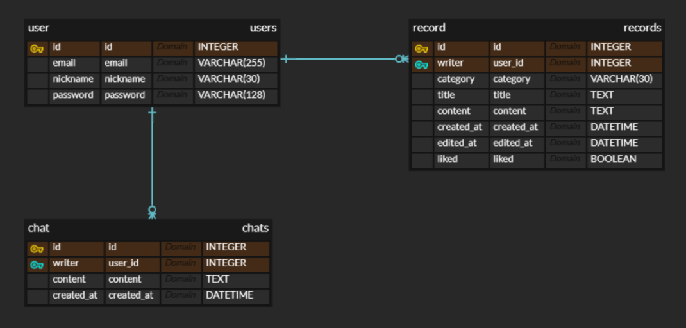
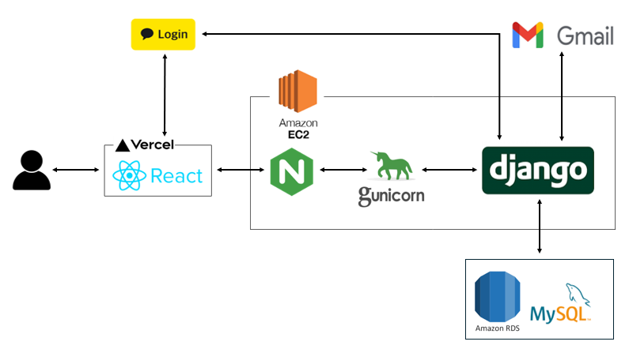

## Mindary - 감정/일상 기록 기반 웹서비스 (Backend)
### 🦁멋쟁이사자처럼대학 12기 중앙 해커톤 프로젝트 (2024.07~2024.08)

> 본 레포지토리는 Mindary 전체 프로젝트를 포크(Fork)한 뒤,  
> **오류 수정 및 백엔드 리팩토링 중심으로 개선**한 버전입니다.  
> 프론트엔드 코드도 함께 포함되어 있으나, 이 저장소는 **백엔드 구현 중심의 포트폴리오용**입니다.

<details>
<summary>버그 수정 및 리팩토링 내역</summary>
1️⃣ 카카오 로그인 시 인증 오류 발생
- **원인**: 프론트엔드와 백엔드 간 토큰 필드명 불일치  
  → 프론트는 `access_token`, 백엔드는 `token`으로 처리 중  
- **해결**: 양측 모두 `access_token`으로 통일하여 OAuth 인증 정상 처리

2️⃣ 워드클라우드 생성 실패 (204 예외)
- **원인**: 사용자 기록이 없는데도 워드클라우드 요청이 발생 → 본문 없음에 대한 예외 누락  
- **해결**: 본문이 없을 경우 `204 No Content` 반환 및 프론트에 안내 메시지 처리

3️⃣ 워드클라우드 이미지 생성 지연 (타임아웃)
- **원인**: 이미지 생성 시간이 길어 프론트 요청 타임아웃 초과  
- **해결**: 프론트엔드에서 요청 타임아웃 시간을 조정하여 문제 해결  

4️⃣ 리팩토링
- 중복된 워드클라우드 생성 로직을 별도 메소드로 추출하여 코드 재사용성 및 가독성 향상
</details>

### 프로젝트 개요
- 직장인도 부담 없이 사용할 수 있는 **엑셀UI 형식의 감정/일상 기록 서비스**
- 기능:
  - 일반 로그인 / 카카오 로그인
  - (짧은 메모 / 긴 글) 모드
  -  (카테고리/키워드 별) 긴 글 조회
  -  긴 글 작성 → 빈도수 기반 랭킹으로 키워드 추출 -> 주간/월간 결산(워드클라우드로 시각화)

<details>
<summary>📘 자세한 서비스 소개 보기</summary>

**Mindary**는 현대인의 정신 건강 문제에 주목해, 감정을 부담 없이 기록할 수 있도록 돕는 웹 기반 감정 다이어리 서비스입니다.  
일상 속 스트레스를 해소하고, 기록 습관을 통해 자기 성찰의 기회를 제공하는 것이 주요 목적입니다.

서비스의 UI는 **엑셀 형태를 차용**하여 직장 환경에서도 부담 없이 사용할 수 있는 감정 기록 공간을 제공합니다.  
스트레스를 받는 순간엔 마치 카카오톡 ‘나와의 채팅’처럼 **혼잣말을 자유롭게 적어 감정을 해소**할 수 있고,  
또는 퇴근길에 해야 할 일이나 기억해둘 메모를 남기는 용도로도 활용할 수 있습니다.

긴 글 모드에선 자유로운 카테고리(일상/영화/독서 등)로 글을 작성하고, 캘린더를 통해 일별 기록을 직관적으로 확인할 수 있습니다.  
또한, 주간/월간 결산 워드클라우드를 통해 **자주 언급된 단어들을 시각적으로 확인**하며, 최근의 감정 흐름이나 관심사를 돌아볼 수 있습니다.
</details>

---

### 나의 역할
- 시스템 아키텍처 및 ERD 설계, API 명세서 작성
- Django 기반 REST API 전반 구현 (총 기여도 약 60%)
- JWT 인증 시스템 구축 (SimpleJWT 활용)  
- Gmail SMTP 연동을 통한 이메일 인증/임시 비밀번호 발송 로직 구현  
- 긴 글 CRUD 구현
- `krwordrank` 기반 키워드 추출 및 `WordCloud` 시각화 구현  
- `django-cron`을 활용해 주간/월간 워드클라우드 자동 생성 스케줄링 설정
- EC2 기반 서버 배포 및 Gunicorn + Nginx 운영 환경 구성
- AWS RDS(MySQL) 연동 및 ORM/마이그레이션 설정 구성

---

### 🛠️ 기술 스택(백엔드)


---

### 서비스 UI 예시

<details>
<summary>서비스 UI 예시 보기</summary>

- **랜딩 페이지 - 블랙 버전**  
  

- **랜딩 페이지 - 그린 버전**  
  

- **로그인 화면**  
  

- **회원가입 페이지**  
  

- **새 비밀번호 생성**  
  

- **채팅 모드**  
  

- **긴글 목록 / 작성하기**  
    
  

- **아카이브 UI**  
  

</details>

---

### ERD

> 

---

### 시스템 아키텍처

> 

---

### 서버 실행 방법

```bash
git clone https://github.com/mdy3722/Mindary-Refactoring.git
cd BACKEND-refactor/

python -m venv venv
source venv/bin/activate (Mac) 또는 source venv/Scripts/activate (Window)

pip install -r requirements.txt
python manage.py migrate
python manage.py runserver
```

---

### 기타 설정 (RDS / SMTP)

이 프로젝트는 `.env` 파일을 통해 민감 정보를 관리하며, `settings.py`에서는 환경변수 기반으로 설정을 구성합니다.  
아래는 백엔드 구동을 위한 주요 설정 예시입니다:

```
# ▶️ RDS(MySQL) 연동 설정 (settings.py)
DATABASES = {
    'default': {
        'ENGINE': 'django.db.backends.mysql',
        'NAME': os.environ.get('DB_NAME'),
        'USER': os.environ.get('DB_USER'),
        'PASSWORD': os.environ.get('DB_PASSWORD'),
        'HOST': os.environ.get('DB_HOST'),
        'PORT': os.environ.get('DB_PORT'),
    }
}

# ▶️ 이메일(SMTP) 인증 설정 (settings.py)
EMAIL_BACKEND = 'django.core.mail.backends.smtp.EmailBackend'
EMAIL_HOST = 'smtp.gmail.com'
EMAIL_PORT = 587
EMAIL_USE_TLS = True
EMAIL_USE_SSL = False
EMAIL_HOST_USER = os.environ.get('EMAIL_HOST_USER')
EMAIL_HOST_PASSWORD = os.environ.get('EMAIL_HOST_PASSWORD')

DEFAULT_FROM_EMAIL = os.environ.get('EMAIL_HOST_USER')


# ▶️ .env 예시

# MySQL (RDS)
DB_NAME=mindary
DB_USER=admin
DB_PASSWORD=yourpassword
DB_HOST=mindary-db.abcdefghij.ap-northeast-2.rds.amazonaws.com
DB_PORT=3306

# Gmail SMTP
EMAIL_HOST_USER=your_email@gmail.com
EMAIL_HOST_PASSWORD=your_app_password
```

> 🔐 `.env` 파일은 반드시 `.gitignore`에 포함되어야 하며, 실제 비밀번호나 이메일은 외부에 노출되지 않도록 주의합니다.  
> 📬 Gmail SMTP를 사용할 경우 [앱 비밀번호](https://support.google.com/accounts/answer/185833?hl=ko) 발급이 필요합니다.
